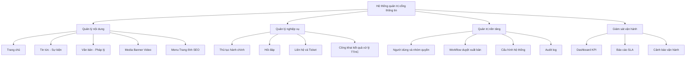
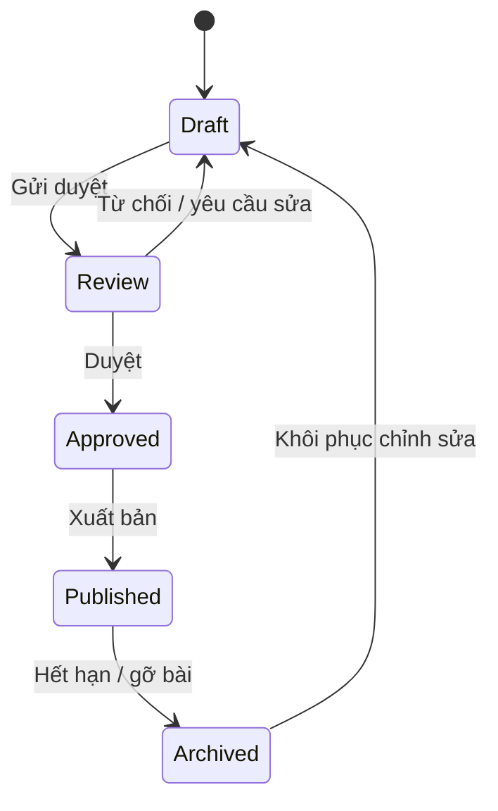
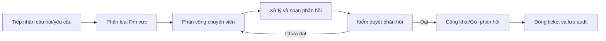
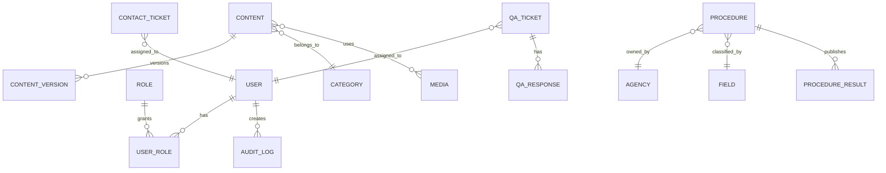
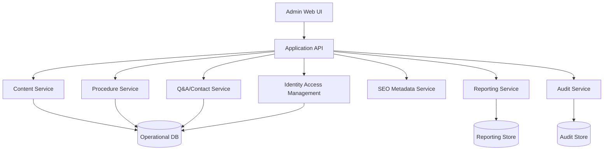
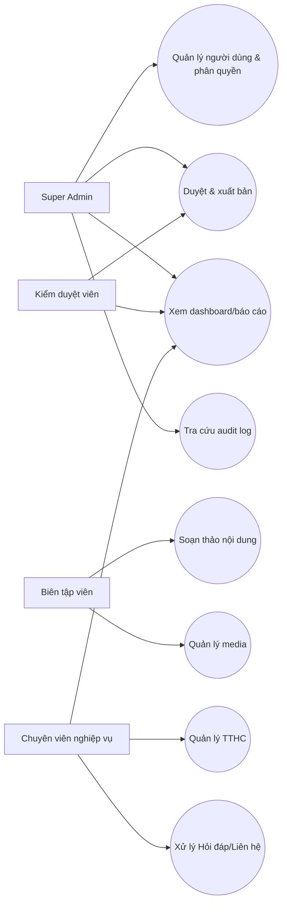

# Danh mục chức năng hệ thống quản trị cổng thông tin VPDKĐĐ Thanh Hóa

## 1. Tổng quan hệ thống và mục tiêu vận hành

### 1.1 Mục tiêu
- Xây dựng hệ thống quản trị nội dung và nghiệp vụ cho cổng thông tin điện tử VPDKĐĐ Thanh Hóa.
- Chuẩn hóa quy trình biên tập, kiểm duyệt, xuất bản và công khai thông tin.
- Tăng tốc xử lý thông tin cho người dân: tra cứu TTHC, hỏi đáp, liên hệ, thông báo.
- Đảm bảo khả năng mở rộng cho báo cáo vận hành, audit log, SEO, tích hợp hệ thống ngoài.

### 1.2 Phạm vi
- In-scope: trang chủ, tin tức, văn bản, TTHC, hỏi đáp, liên hệ, media, menu/trang tĩnh, người dùng & quyền, báo cáo.
- In-scope mở rộng: SLA, audit log, dashboard vận hành, metadata SEO, cấu hình hệ thống.
- Out-of-scope ở giai đoạn tài liệu: lựa chọn framework, thiết kế vật lý DB chi tiết, lựa chọn hạ tầng cloud cụ thể.

### 1.3 Đối tượng sử dụng
- Người dân/tổ chức (truy cập thông tin công khai).
- Cán bộ nghiệp vụ và đội quản trị nội dung.
- Quản trị hệ thống và lãnh đạo theo dõi KPI.

---

## 2. Vai trò hệ thống và ma trận quyền

### 2.1 Vai trò chuẩn
- **Super Admin**: toàn quyền cấu hình hệ thống, người dùng, quyền, audit, xuất bản khẩn.
- **Biên tập viên**: tạo/sửa nội dung, quản lý media, chuẩn bị bản nháp.
- **Kiểm duyệt viên**: duyệt nội dung, trả lại chỉnh sửa, xuất bản/gỡ xuất bản theo quy trình.
- **Chuyên viên nghiệp vụ**: quản lý module nghiệp vụ (TTHC, Hỏi đáp, Liên hệ), xử lý ticket, cập nhật trạng thái.

### 2.2 Ma trận quyền (R=Read, C=Create, U=Update, D=Delete, A=Approve/Publish, X=Admin)

| Module | Super Admin | Biên tập viên | Kiểm duyệt viên | Chuyên viên nghiệp vụ |
|---|---|---|---|---|
| Trang chủ | R C U D A X | R C U | R A | R |
| Tin tức/Sự kiện | R C U D A X | R C U | R A | R |
| Văn bản/Pháp lý | R C U D A X | R C U | R A | R |
| TTHC | R C U D A X | R | R A | R C U |
| Hỏi đáp | R C U D A X | R C U | R A | R C U |
| Liên hệ/Ticket | R C U D A X | R | R | R C U |
| Media/Banner/Video | R C U D A X | R C U D | R | R |
| Menu/Trang tĩnh/SEO | R C U D A X | R C U | R A | R |
| Người dùng & phân quyền | R C U D X | R | R | R |
| Audit log | R X | R | R | R |
| Báo cáo/Dashboard | R X | R | R | R |

---

## 3. Cây phân rã chức năng (FDD)



---

## 4. Đặc tả chức năng chi tiết theo module

## 4.1 Quản lý trang chủ
- **Mục tiêu**: điều phối nội dung nổi bật, ưu tiên thông tin công vụ.
- **Actor chính**: Biên tập viên, Kiểm duyệt viên, Super Admin.
- **Chức năng**:
  - Quản lý hero, nút tác vụ nhanh, khối tin mới, thông báo, video.
  - Quản lý chuyên mục trọng tâm và sidebar tiện ích.
  - Ghim nội dung lên vị trí ưu tiên, hẹn giờ hiển thị/ẩn.
- **Dữ liệu cốt lõi**: tiêu đề khối, danh sách bài gắn khối, thứ tự hiển thị, trạng thái publish.
- **Quyền**: Biên tập viên tạo bản nháp cấu hình; Kiểm duyệt viên phê duyệt; Super Admin override.
- **KPI**: thời gian cập nhật khối nóng < 30 phút; CTR khối tra cứu nhanh.
- **Rủi ro**: xung đột thứ tự hiển thị, thiếu cơ chế preview theo thiết bị.

## 4.2 Quản lý Tin tức/Sự kiện
- **Mục tiêu**: quản trị vòng đời tin tức từ soạn thảo đến lưu trữ.
- **Actor**: Biên tập viên, Kiểm duyệt viên, Super Admin.
- **Chức năng**:
  - Thêm mới, sửa, lưu nháp, gửi duyệt, duyệt, xuất bản, gỡ bài, lưu trữ.
  - Quản lý danh mục, tag, ảnh đại diện, bài ghim trang chủ.
  - Hẹn giờ publish và expire.
- **Dữ liệu**: title, slug, summary, content, thumbnail, category, tags, status, featured.
- **KPI**: tỷ lệ bài có đủ metadata > 95%; thời gian duyệt trung bình.
- **Rủi ro**: trùng slug, thiếu kiểm soát lịch publish chồng chéo.

## 4.3 Quản lý Văn bản/Pháp lý
- **Mục tiêu**: công khai văn bản chuẩn, dễ tra cứu.
- **Actor**: Biên tập viên, Kiểm duyệt viên.
- **Chức năng**:
  - Quản lý văn bản theo loại, số hiệu, ngày ban hành, hiệu lực.
  - Đính kèm file PDF/Word, quản lý phiên bản văn bản.
  - Gắn văn bản vào chuyên mục hoặc bài liên quan.
- **Dữ liệu**: document_no, issue_date, effective_date, file_url, status, version.
- **KPI**: tỷ lệ văn bản đúng phiên bản hiệu lực.
- **Rủi ro**: cập nhật sai hiệu lực, link file hỏng.

## 4.4 Quản lý Thủ tục hành chính (TTHC)
- **Mục tiêu**: chuẩn hóa danh mục thủ tục và trải nghiệm tra cứu.
- **Actor**: Chuyên viên nghiệp vụ, Kiểm duyệt viên, Super Admin.
- **Chức năng**:
  - CRUD thủ tục, cơ quan, lĩnh vực, mức dịch vụ công.
  - Quản lý hồ sơ mẫu, thành phần hồ sơ, thời hạn xử lý, phí lệ phí.
  - Công khai kết quả xử lý và cập nhật trạng thái hồ sơ công khai.
- **Dữ liệu**: procedure_code, agency, field, service_level, duration_days, fee, status.
- **KPI**: tỷ lệ thủ tục cập nhật đúng hạn; tỷ lệ tra cứu thành công trong 3 thao tác.
- **Rủi ro**: dữ liệu thủ tục không đồng bộ giữa danh mục và công khai kết quả.

## 4.5 Quản lý Hỏi đáp
- **Mục tiêu**: tiếp nhận và phản hồi câu hỏi đúng SLA.
- **Actor**: Chuyên viên nghiệp vụ, Kiểm duyệt viên.
- **Chức năng**:
  - Nhận câu hỏi từ người dân, phân loại lĩnh vực, phân công xử lý.
  - Trả lời nội bộ, duyệt trả lời, công khai câu trả lời.
  - Theo dõi trạng thái: mới, đang xử lý, chờ duyệt, đã trả lời, đóng.
- **Dữ liệu**: question, field, requester_info, assignee, response_content, ticket_status.
- **KPI**: SLA phản hồi đầu tiên; tỷ lệ câu hỏi xử lý đúng hạn.
- **Rủi ro**: quá hạn xử lý, phản hồi chưa nhất quán nghiệp vụ.

## 4.6 Quản lý Liên hệ
- **Mục tiêu**: quản lý đầu mối liên hệ và yêu cầu hỗ trợ.
- **Actor**: Chuyên viên nghiệp vụ, Super Admin.
- **Chức năng**:
  - Quản lý danh sách liên hệ theo đơn vị/chi nhánh.
  - Quản lý form liên hệ, ticket hỗ trợ, theo dõi lịch sử xử lý.
  - Cấu hình kênh nhận thông tin: email, điện thoại, form web.
- **Dữ liệu**: contact_type, channel, requester_info, ticket_status, response_deadline.
- **KPI**: thời gian phản hồi ticket; tỷ lệ ticket đóng đúng hạn.
- **Rủi ro**: mất dấu ticket, thiếu lịch sử xử lý.

## 4.7 Quản lý Media/Banner/Video
- **Mục tiêu**: quản trị tài nguyên đa phương tiện tập trung.
- **Actor**: Biên tập viên, Super Admin.
- **Chức năng**:
  - Upload media, phân loại thư viện, gắn alt text, version ảnh.
  - Quản lý banner theo vị trí, lịch hiển thị, click tracking.
  - Quản lý video nhúng và metadata.
- **KPI**: tỷ lệ media có alt text; dung lượng tối ưu trung bình.
- **Rủi ro**: media nặng gây chậm trang, thiếu chuẩn đặt tên file.

## 4.8 Quản lý Menu, Trang tĩnh, SEO metadata
- **Mục tiêu**: tối ưu điều hướng và khả năng tìm kiếm.
- **Actor**: Biên tập viên, Kiểm duyệt viên.
- **Chức năng**:
  - Quản lý menu đa cấp, trang tĩnh, footer link.
  - Quản lý SEO title, description, canonical, OpenGraph.
  - Quản lý redirect URL khi đổi slug.
- **KPI**: tỷ lệ trang có đủ metadata > 95%.
- **Rủi ro**: lỗi điều hướng, duplicate metadata.

## 4.9 Quản trị người dùng, nhóm quyền, audit log
- **Mục tiêu**: kiểm soát truy cập và truy vết thay đổi.
- **Actor**: Super Admin.
- **Chức năng**:
  - Quản lý user, vai trò, nhóm phòng ban.
  - Bật/tắt quyền chức năng theo module.
  - Lưu nhật ký thao tác: ai, làm gì, lúc nào, trên bản ghi nào.
- **KPI**: 100% thao tác quan trọng có audit trace.
- **Rủi ro**: phân quyền quá rộng, thiếu giám sát bất thường.

## 4.10 Thống kê, báo cáo, dashboard vận hành
- **Mục tiêu**: theo dõi hiệu suất nội dung và chất lượng xử lý nghiệp vụ.
- **Actor**: Super Admin, lãnh đạo, kiểm duyệt.
- **Chức năng**:
  - Dashboard realtime: truy cập, bài xuất bản, ticket mở, SLA.
  - Báo cáo định kỳ theo module và theo đơn vị.
  - Cảnh báo quá hạn SLA và bất thường lưu lượng.
- **KPI**: tính đúng/sớm của báo cáo; tỷ lệ cảnh báo được xử lý.
- **Rủi ro**: số liệu thiếu nhất quán nguồn, chậm cập nhật.

---

## 5. Quy trình nghiệp vụ chuẩn

### 5.1 Vòng đời nội dung


### 5.2 Quy trình xử lý Hỏi đáp/Liên hệ


### 5.3 Quy trình cập nhật TTHC và công khai kết quả
- Chuyên viên cập nhật bản nháp thủ tục.
- Kiểm duyệt viên đối soát nội dung pháp lý.
- Xuất bản danh mục TTHC.
- Đồng bộ sang module công khai kết quả.
- Hệ thống kiểm tra tính hợp lệ dữ liệu trước khi công khai.

---

## 6. Mô hình dữ liệu nghiệp vụ (conceptual)



### 6.1 Thực thể chính và trường cốt lõi
- **Content**: id, title, slug, summary, body, thumbnail, status, featured, published_at.
- **Procedure**: procedure_code, agency_id, field_id, service_level, effective_date, status.
- **QA Ticket**: ticket_id, question, requester_info, field, assignee, ticket_status, response_deadline.
- **Contact Ticket**: ticket_id, contact_type, channel, requester_info, assignee, ticket_status.
- **Audit Log**: actor_id, action, module, record_id, old_value, new_value, created_at.

---

## 7. Interface/contract mức hệ thống

### 7.1 Contract nội dung tin
```json
{
  "title": "string",
  "slug": "string",
  "summary": "string",
  "thumbnail": "string",
  "published_at": "datetime",
  "status": "draft|review|approved|published|archived",
  "featured": "boolean"
}
```

### 7.2 Contract TTHC
```json
{
  "procedure_code": "string",
  "agency": "string",
  "field": "string",
  "service_level": "2|3|4",
  "effective_date": "date",
  "status": "active|inactive|archived"
}
```

### 7.3 Contract liên hệ/yêu cầu hỗ trợ
```json
{
  "contact_type": "general|complaint|guidance",
  "channel": "web|email|phone",
  "requester_info": {
    "full_name": "string",
    "phone": "string",
    "email": "string"
  },
  "ticket_status": "new|assigned|in_progress|review|closed",
  "assignee": "user_id",
  "response_deadline": "datetime"
}
```

### 7.4 Sơ đồ kiến trúc logic module quản trị


---

## 8. KPI, SLA và tiêu chí nghiệm thu theo module

| Module | KPI/SLA chính | Tiêu chí nghiệm thu |
|---|---|---|
| Trang chủ | Cập nhật nội dung khẩn < 30 phút | Có cơ chế ghim/ẩn/hẹn giờ và preview |
| Tin tức | Tỷ lệ bài đủ metadata > 95% | Workflow Draft->Published chạy đúng quyền |
| Văn bản | 100% văn bản có hiệu lực rõ ràng | Quản lý phiên bản và file đính kèm hoạt động |
| TTHC | Tra cứu thành công <= 3 thao tác | Bộ lọc đúng, dữ liệu thủ tục nhất quán |
| Hỏi đáp | 90% ticket phản hồi đầu tiên <= SLA | Có phân công, trạng thái, lịch sử xử lý |
| Liên hệ | 95% ticket đóng đúng hạn | Quản lý đầu mối + ticket đầy đủ |
| Media | 95% media có alt text | Upload, gắn vị trí, lifecycle media rõ |
| Menu/SEO | 95% trang có metadata | Điều hướng đúng và hỗ trợ redirect |
| User/Role | 100% quyền áp dụng đúng role | Không truy cập trái quyền |
| Audit | 100% thao tác quan trọng có log | Truy vết được theo user/module/thời gian |
| Dashboard | Báo cáo cập nhật theo chu kỳ cam kết | Dashboard có số liệu và lọc theo thời gian |

---

## 9. Roadmap 3 giai đoạn

### Giai đoạn 1: Nền tảng CMS
- Quản lý người dùng/quyền cơ bản.
- Quản lý trang chủ, tin tức, media, menu/trang tĩnh.
- Workflow duyệt nội dung cơ bản, xuất bản và lưu trữ.
- Dashboard sơ bộ: bài viết, truy cập, trạng thái xuất bản.

### Giai đoạn 2: Nghiệp vụ chuyên sâu
- Quản lý TTHC đầy đủ danh mục + bộ lọc + công khai kết quả.
- Quản lý Hỏi đáp và Liên hệ theo ticket + SLA.
- Audit log chuẩn hóa cho thao tác nghiệp vụ.
- Báo cáo vận hành theo đơn vị/phòng ban.

### Giai đoạn 3: Tối ưu và mở rộng
- SEO nâng cao, tối ưu hiệu năng tải trang.
- Dashboard nâng cao và cảnh báo vận hành.
- Tích hợp mở rộng (kênh đồng bộ nội bộ, dịch vụ liên thông nếu có).
- Chuẩn hóa quy trình kiểm soát chất lượng dữ liệu.

---

## 10. Backlog tương lai (MoSCoW)

### Must
- Workflow duyệt đa bước theo phòng ban.
- SLA và cảnh báo quá hạn ticket.
- Audit log không thể sửa/xóa.

### Should
- Dashboard realtime theo vai trò.
- Mẫu nội dung chuẩn cho từng loại chuyên mục.
- Tự động kiểm tra chất lượng SEO trước khi xuất bản.

### Could
- Gợi ý phân loại nội dung bằng AI nội bộ.
- Tóm tắt tự động văn bản dài.
- Cá nhân hóa dashboard theo người dùng.

### Won't (giai đoạn hiện tại)
- Triển khai app mobile native riêng.
- Tích hợp chatbot đa kênh ngoài phạm vi web portal.

---

## 11. Sơ đồ use-case theo vai trò



---

## 12. Checklist kiểm thử tài liệu

### 12.1 Tính đầy đủ
- Mỗi module có mục tiêu, actor, chức năng, dữ liệu, quyền, KPI, rủi ro.
- Có đủ 5 sơ đồ Mermaid theo yêu cầu.

### 12.2 Tính nhất quán
- Trạng thái workflow đồng nhất giữa bảng mô tả và sơ đồ state.
- Ma trận quyền khớp với sơ đồ use-case.
- Tên thực thể dữ liệu đồng nhất với contract.

### 12.3 Khả dụng kỹ thuật
- File Markdown render tốt trong IDE/Git viewer.
- Các block Mermaid render không lỗi cú pháp.
- Tất cả nội dung lưu UTF-8 tiếng Việt đầy đủ dấu.

### 12.4 Sẵn sàng triển khai
- Không còn quyết định mở ở mức nghiệp vụ.
- Có tiêu chí nghiệm thu và KPI cho từng module/giai đoạn.
- Có roadmap theo thứ tự ưu tiên 3 giai đoạn.

