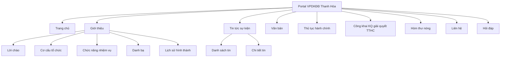
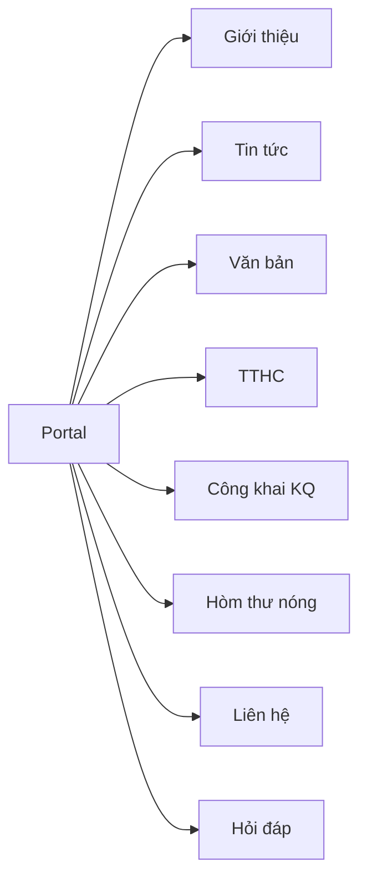
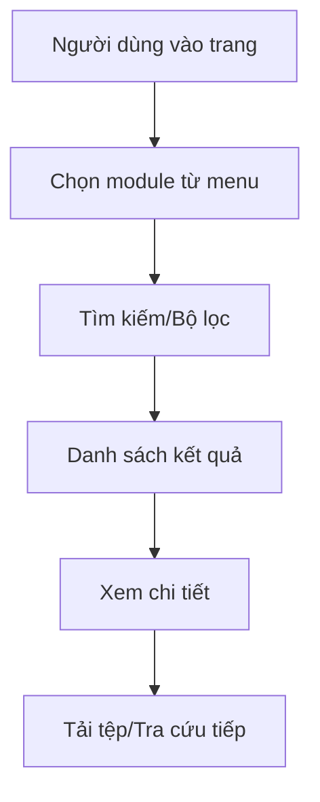
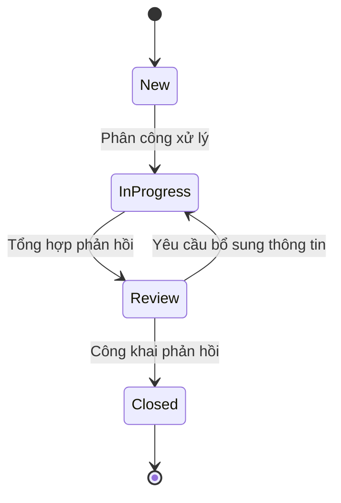
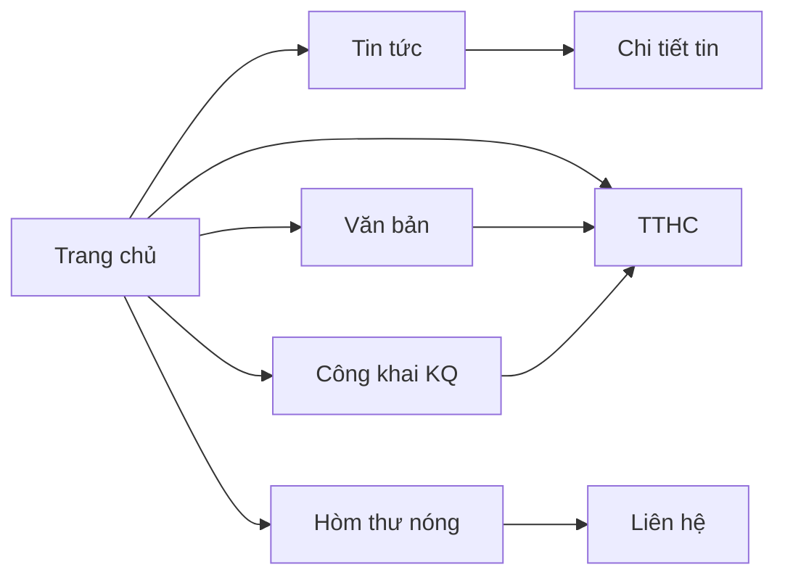

# Portal Modernization Overview - VPDKĐĐ Thanh Hóa

## 1. Tổng quan mục tiêu và phạm vi

### 1.1 Mục tiêu
- Hoàn thiện toàn bộ portal theo ngôn ngữ giao diện hiện đại đã triển khai.
- Đồng nhất trải nghiệm cho toàn menu: điều hướng, bố cục, lọc/tra cứu, hiển thị trạng thái.
- Tạo nền tảng sẵn sàng tích hợp dữ liệu thực và vận hành quản trị nội dung.

### 1.2 Phạm vi triển khai portal
- Trang chủ.
- Giới thiệu.
- Tin tức sự kiện (list + detail).
- Văn bản.
- Thủ tục hành chính.
- Công khai KQ giải quyết TTHC.
- Hòm thư nóng.
- Liên hệ.
- Hỏi đáp.

### 1.3 Phạm vi tài liệu
- Danh mục chức năng portal + nhóm chức năng admin liên quan vận hành nội dung.
- Mapping giao diện cũ -> mới cho module trọng điểm.
- IA toàn menu, user flow, data contracts, roadmap, tiêu chí nghiệm thu.

---

## 2. Kiến trúc thông tin (IA) toàn menu portal



---

## 3. Danh mục chức năng hệ thống (tổng quan)

## 3.1 Chức năng portal theo module
- **Trang chủ**:
  - Hero tra cứu nhanh.
  - Khối tin nổi bật, thông báo, video.
  - Khối chuyên mục trọng tâm.
  - Sidebar tiện ích và thống kê truy cập.
- **Giới thiệu**:
  - Trang tổng + các nhóm trang con.
  - Danh bạ liên hệ dạng bảng.
- **Tin tức sự kiện**:
  - Danh sách bài viết dạng card/list.
  - Lọc theo từ khóa/chuyên mục/thời gian.
  - Trang chi tiết bài viết.
- **Văn bản**:
  - Bảng văn bản theo số hiệu/loại/ngày/trạng thái hiệu lực.
  - Lọc đa tiêu chí, tải tệp đính kèm.
- **Thủ tục hành chính**:
  - Bộ lọc theo cơ quan/lĩnh vực/mức độ/từ khóa.
  - Bảng tra cứu thủ tục.
- **Công khai KQ giải quyết TTHC**:
  - Bảng công khai hồ sơ đã xử lý.
  - Lọc theo mã hồ sơ/nhóm thủ tục/trạng thái/thời gian.
- **Hòm thư nóng**:
  - Form phản ánh, kiến nghị.
  - Quy trình tiếp nhận xử lý công khai.
  - Bảng trạng thái ticket công khai mức phù hợp.
- **Liên hệ**:
  - Thông tin đơn vị và kênh liên hệ nhanh.
  - Form gửi yêu cầu hỗ trợ.
- **Hỏi đáp**:
  - Danh sách Q&A.
  - Lọc theo lĩnh vực, trạng thái, từ khóa.

## 3.2 Chức năng admin liên quan vận hành portal (tóm tắt)
- Quản lý trang chủ (khối nội dung, pin/unpin, lịch publish).
- Quản lý tin tức, văn bản, media.
- Duyệt nội dung theo workflow.
- Theo dõi audit/workflow history.

---

## 4. Mapping giao diện cũ -> giao diện mới (chi tiết)

| Module | Thành phần cũ | Vấn đề UX cũ | Thiết kế mới thay thế | Lợi ích |
|---|---|---|---|---|
| Giới thiệu | Danh sách liên kết tĩnh bên trái | Khó đọc trên mobile, ít phân cấp | Bố cục 3 vùng: sidenav + nội dung chính + rail | Điều hướng nhanh, dễ mở rộng nội dung |
| Tin tức sự kiện | List ảnh + tiêu đề dàn trải | Mật độ cao, lọc hạn chế | Card/list hiện đại + bộ lọc theo chuyên mục/thời gian + detail page | Tra cứu tin nhanh, giảm tải nhận thức |
| Văn bản | Danh sách chưa chuẩn bảng dữ liệu | Khó đối chiếu số hiệu/hiệu lực | Data table có cột chuẩn + filter nhiều tiêu chí | Minh bạch, kiểm tra văn bản nhanh |
| Hòm thư nóng | Liên kết/khối thông tin rời rạc | Thiếu quy trình và theo dõi trạng thái rõ | Form chuẩn + quy trình xử lý + bảng trạng thái ticket | Tăng niềm tin, dễ theo dõi tiến độ phản ánh |
| Công khai KQ TTHC | Danh sách công khai cũ ít lọc | Khó tìm mã hồ sơ, khó quét trạng thái | Bảng công khai có filter mã/nhóm/trạng thái/thời gian | Tìm kết quả nhanh, tăng minh bạch |

### 4.1 Cập nhật mới cho module Giới thiệu (đồng bộ triển khai)
- `#co-cau` đã chuyển từ danh sách bullet sang sơ đồ tổ chức top-down bằng HTML/CSS:
  - Tầng 1: Giám đốc Văn phòng.
  - Tầng 2: 2 Phó Giám đốc theo nhóm phụ trách.
  - Tầng 3: 4 đơn vị chuyên môn/chi nhánh.
- `#chuc-nang` đã chuyển từ danh sách dài sang `capability cards` 2x2:
  - Mỗi card gồm tiêu đề nhiệm vụ, mô tả ngắn, và 2 đầu ra thực hiện.
- Chuẩn responsive:
  - Desktop: sơ đồ 3 tầng + capability 2 cột.
  - Tablet: giữ khả năng quét nhanh theo cụm.
  - Mobile: chuyển stack dọc, ưu tiên dễ đọc và không tràn ngang.
- Không thay đổi API/backend; chỉ thay đổi lớp trình bày và class front-end (`org-chart`, `org-level`, `org-node`, `capability-grid`, `capability-card`).

---

## 5. Data contracts/type map cho FE/BE

### 5.1 ContentItem
```json
{
  "title": "string",
  "slug": "string",
  "summary": "string",
  "thumbnail": "string",
  "category": "string",
  "published_at": "datetime",
  "status": "draft|review|approved|published|archived",
  "featured": "boolean"
}
```

### 5.2 LegalDocument
```json
{
  "document_no": "string",
  "doc_type": "quyet-dinh|thong-bao|huong-dan",
  "issue_date": "date",
  "effective_date": "date",
  "status": "con-hieu-luc|het-hieu-luc",
  "file_url": "string"
}
```

### 5.3 PublicResult
```json
{
  "record_code": "string",
  "procedure_name": "string",
  "applicant_masked": "string",
  "processed_at": "date",
  "result_status": "done|pending|supplement",
  "detail_url": "string"
}
```

### 5.4 HotlineTicketPublic
```json
{
  "ticket_code": "string",
  "channel": "web|email|phone",
  "topic": "string",
  "created_at": "date",
  "processing_status": "new|in_progress|closed"
}
```

### 5.5 Trạng thái UI dùng chung
- `empty`
- `loading`
- `error`
- `no_permission`
- `archived`
- `scheduled`

---

## 6. Luồng người dùng chính (Mermaid)

### 6.1 FDD portal


### 6.2 User flow: tra cứu tin/văn bản/công khai KQ


### 6.3 State flow xử lý phản ánh Hòm thư nóng


### 6.4 Sơ đồ điều hướng menu và liên kết chéo


---

## 7. Roadmap triển khai 3 giai đoạn

### Giai đoạn 1: 5 module trọng điểm + khung layout
- Hoàn thiện `Giới thiệu`, `Tin tức`, `Văn bản`, `Hòm thư nóng`, `Công khai KQ`.
- Chuẩn hóa menu, breadcrumb, filter bar, right rail, footer.
- Hoàn thiện điều hướng full menu.

### Giai đoạn 2: hoàn thiện toàn menu + tối ưu UX
- Đồng bộ sâu các trang `TTHC`, `Hỏi đáp`, `Liên hệ`, trang chi tiết liên quan.
- Chuẩn hóa trạng thái UI, thông báo lỗi, hành vi form.
- Rà soát tính nhất quán typography, spacing, component.

### Giai đoạn 3: chuẩn hóa dữ liệu + SEO + hiệu năng + accessibility
- Tối ưu semantic heading, alt text, keyboard focus.
- Tối ưu ảnh/media, lazy load, hiệu năng hiển thị danh sách.
- Chuẩn hóa metadata SEO cho toàn bộ trang.

---

## 8. Test plan và acceptance criteria

### 8.1 IA và điều hướng
- Từ menu chính đi đến mọi trang trong tối đa 2 click.
- Breadcrumb chính xác ở toàn bộ trang cấp 2/cấp 3.

### 8.2 UI nhất quán
- Các trang list dùng cùng pattern filter/sort/pagination.
- Badge trạng thái và trạng thái UI dùng chung đồng nhất.

### 8.3 Nghiệp vụ 5 module trọng điểm
- Tin tức: lọc theo chuyên mục/ngày, mở chi tiết đúng.
- Văn bản: lọc và tải file hoạt động, hiển thị hiệu lực rõ.
- Công khai KQ: tra cứu và xem chi tiết kết quả.
- Hòm thư nóng: gửi form hợp lệ, hiển thị thông báo phản hồi.
- Giới thiệu: điều hướng đầy đủ các trang con.

### 8.4 Responsive + Accessibility
- Kiểm tra desktop/tablet/mobile cho các trang có right rail và data table.
- Keyboard navigation, focus ring, contrast đạt chuẩn.

### 8.5 Tài liệu Markdown
- UTF-8 tiếng Việt hiển thị đúng.
- Mermaid render không lỗi.
- Có đủ danh mục chức năng, mapping cũ/mới, roadmap và checklist.

---

## 9. Rủi ro, phụ thuộc và checklist triển khai

### 9.1 Rủi ro
- Dữ liệu thực tế chưa đồng bộ ngay khiến một số bảng chỉ có dữ liệu mẫu.
- Khả năng khác biệt chính sách công khai dữ liệu theo từng nhóm hồ sơ.
- Khác biệt trình duyệt cũ ảnh hưởng một số hiệu ứng layout.

### 9.2 Phụ thuộc
- Nguồn dữ liệu CMS/BE cho tin tức, văn bản, kết quả công khai.
- Quy định pháp lý về mức độ công khai thông tin cá nhân.
- Quy chuẩn nội dung/ảnh từ đơn vị nghiệp vụ.

### 9.3 Checklist
- [ ] Full menu có trang đích và link đúng.
- [ ] 5 module trọng điểm có filter/list/detail phù hợp.
- [ ] Mapping cũ/mới hoàn thiện và được nghiệp vụ xác nhận.
- [ ] Contract dữ liệu được thống nhất giữa FE/BE.
- [ ] Test responsive/a11y đạt tiêu chí.
